## Tugas 3 Sistem Operasi
Nama   : Sesilia Miranda 
Nim    : 2110131220010

<h2 align="center">KOMPONEN SISTEM OPERASI</h2>

Sebuah sistem operasi dapat dibagi menjadi beberapa komponen. Secara umum, para pakar sepakat bahwa terdapat sekurangnya empat komponen manajeman utama yaitu:

1. Manajemen Proses, 
2. Manajemen Memori, 
3. Manajamen Sistem Berkas, dan  
4. Manajemen Masukan/Keluaran.

Selain keempat komponen di atas, Avi Silberschatz, dan kawan-kawan menambahkan beberapa komponen seperti:

1. Manajemen Penyimpanan Sekunder. 
2. Manajemen Sistem Proteksi. 
3. Manajemen Jaringan. 
4. Command-Interpreter System.

Di bawah ini merupakan beberapa contoh penerapan dari Komponen Sistem Operasi yang ada pada Laptop saya :

### Manajemen Proses

Proses adalah sebuah program yang sedang dieksekusi. Sebuah proses membutuhkan beberapa sumber daya untuk menyelesaikan tugasnya. Alokasi sumber daya tersebut dikelola oleh Sistem Operasi Umpamanya penggunaan CPU, memori, berkas-berkas, dan perangkat-perangkat M/K. Ketika proses tersebut berhenti dijalankan, sistem operasi akan mendapatkan kembali semua sumber daya yang bisa digunakan kembali.
 

contohnya ketika kita ingin mendownload debian maka langkah pertama yang kita lakukan ialah masuk ke website debian yaitu debian.org , untuk lebih jelasnya seperti gambar yang dibawah ini:

Setelah masuk pada Website tersebut maka akan muncul tampilan seperti dibawah ini;

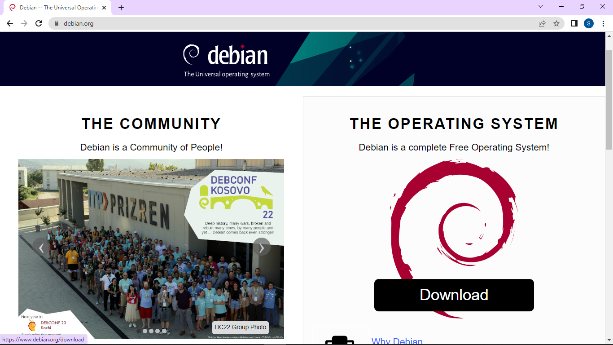 selanjutnya kalian bisa klik pada tombol download untuk melanjutkan ketahapan berikutnya.

 

Setelah kalian klik maka akan muncul tampilan seperti dibawah ini;

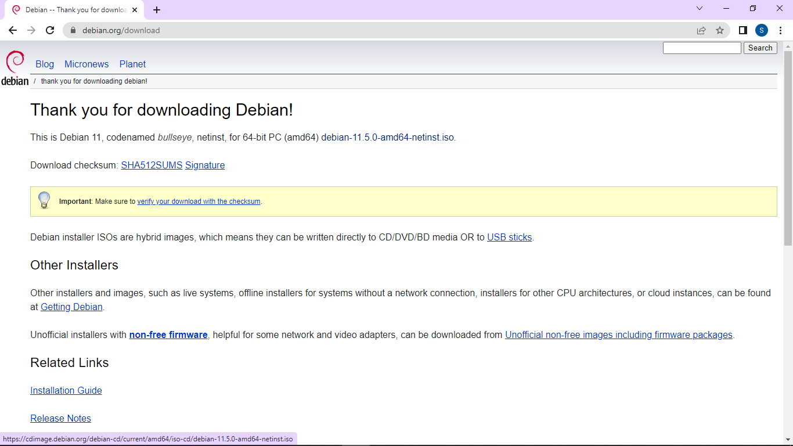  kalian bisa klik tulisan <b>debian-11.5.0-amd64-netinst.iso</b> untuk mendownload versi terbaru dari debian tersebut.

 

Setelah itu akan muncul taampilan dilayar bagian kiri bawah yang memberitahukan poroses penginstalan yang sedang berlangsung seperti di bawah ini;

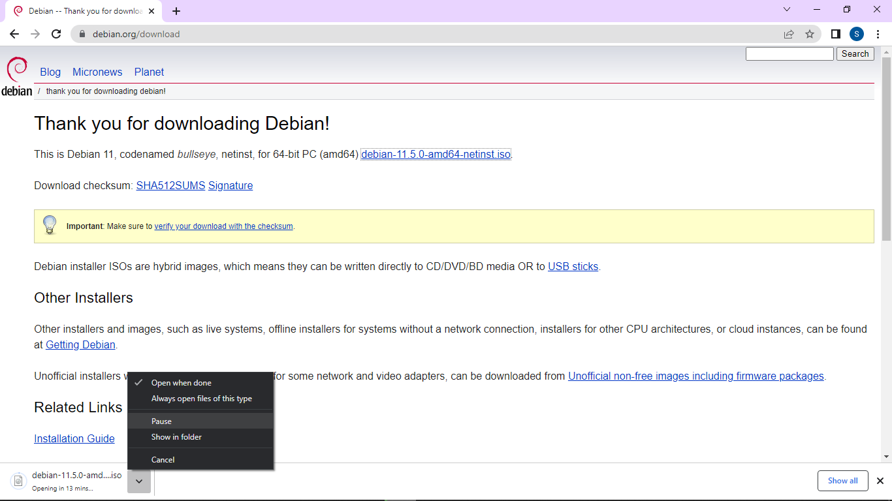 Nah pada bagian ini bisa disebut sebagai Manajemen Pemerosesan dimana sistem operasi bertanggung jawab atas aktivitas penginstaalan dan kalian juga bisa menunda, melanjutkan bahkan menghentikan proses penginstalan yang juga termasuk kedalam Manajemen Pemerosesan.

 

### Manajemen Sistem Berkas

Sistem adalah sekelompok elemen dan prosedur yang saling berhubungan dan  saling bekerja sama dalam pencapaian suatu tujuan tertentu. Manajemen adalah suatu proses perencanaan, pengendalian dan penataan kepada sesuatu agar berjalan secara terstruktur. Berkas adalah kumpulan informasi berkait yang diberi nama dan direkam pada penyimpanan sekunder(secondary storage). Jadi secara bahasa Sistem Manajemen Berkas adalah suatu sistem untuk mengetahui bagaimana cara menyimpan data dari file tertentu dan organisasi file secara terstruktur.

Contoh dari Manajemen Sistem Berkas sendiri ialah ketika kita ingin membuat sebuah Folder baru pada Laptop atau Komputer kita seperti yang di bawah ini;

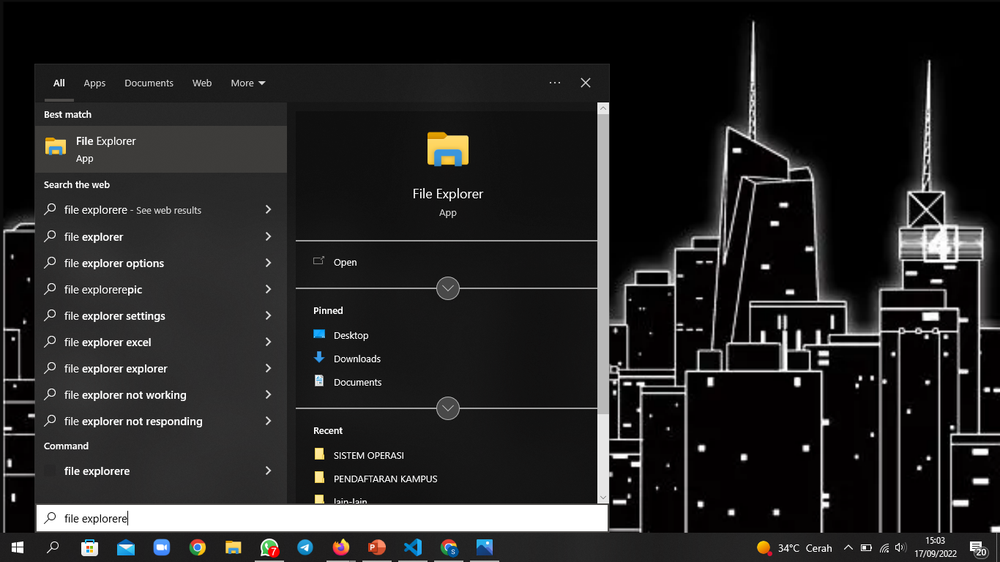  Buka software File Explorer pada laptop kalian seperti pada gambar di atas.

 

Setelah kalian buka File Explorer pada laptop kalian maka akan muncul tampilan seperti yang dibawah ini;

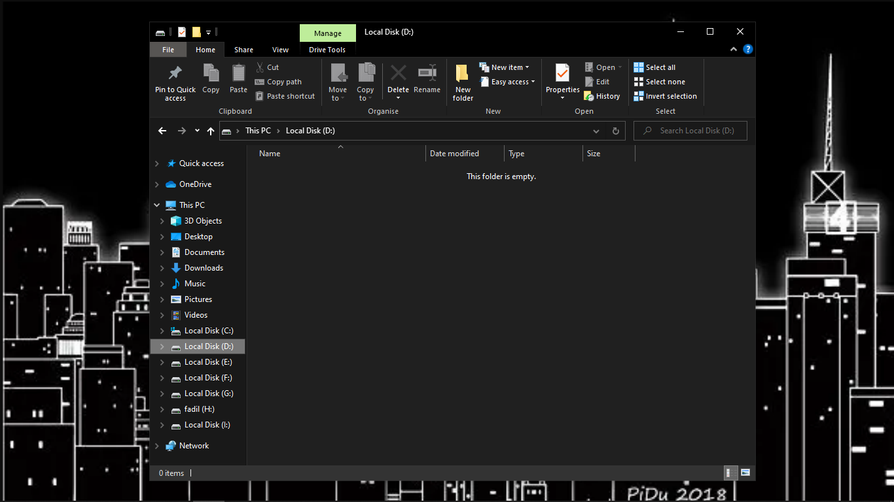

Setelah tampilan pada Laptop kalian sudah sesuai dengan yang gambar yang diatas maka kalian bisa memilih pada bagian atas yaitu <b>New Folder</b> yang berfungsi untuk membuat file baru pada Laptop kalian, seperti pada tampilan dibawah ini;

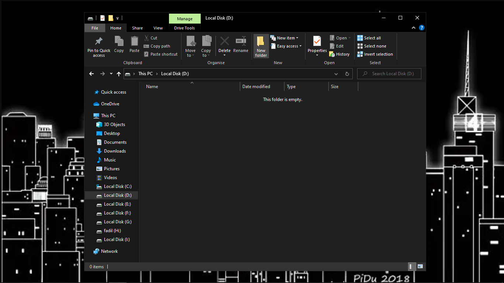

 

Setelah tampilan pada Laptop kalian sudah sesuai dengan gambar sebelumnya, maka akan muncul file berkas pada laptop kalian, selanjutnya kalian bisa mengganti nama file berkas tersebut sesuai dengan nama yang kalian inginkan seperti yang dibawah ini;

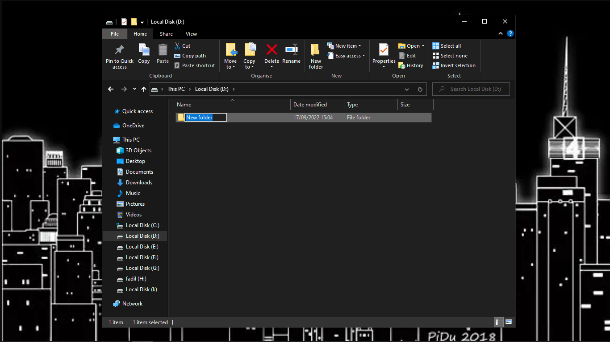

Contohnya saya ingin mengganti nama file tersebut yang awalnya bernama New Folder dan akan saya ubah menjadi TUGAS SISTEM OPERASI seperti pada gambar dibawah ini;

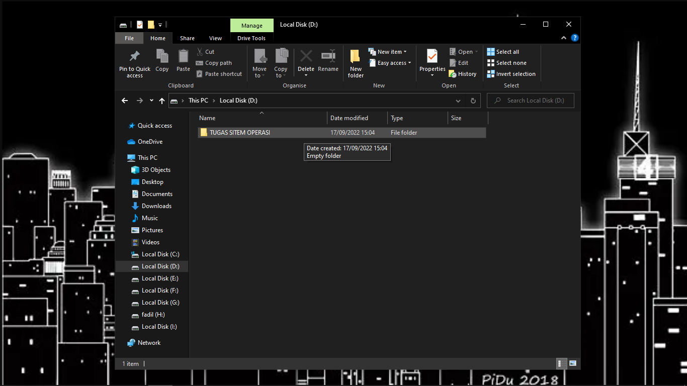 Nah pada bagian ini bisa disebut sebagai Manajemen Sistem Berkas dimana sistem operasi bertanggung jawab atas aktivitas pembuatan atau penghapusan berkas dan kalian juga bisa memanipulasi berkas.

### Manajemen Masukan/Keluaran

Manajemen Masukan/Keluaran sendiri bisa Menyediakan device driver yang umum sehingga operasi Masukan/Keluaran dapat seragam (membuka, membaca, menulis, menutup), berikut contoh penerapannya;

Sebagai contoh dari penerapan Manajemen Masukan/Keluaran kita bisa menggunakan FlashDisk, yang pertama kalia bisa memasukkan FlashDisk ke port USB pada komputer kalian. kalian dapat menemukan port USB di sisi depan, belakang, atau samping komputer (letak port bervariasi tergantung tipe komputer kalian misalnya komputer desktop atau laptop).
 

Setelah FlashDisk tertancap pada port USB, maka kotak dialog akan muncul tampilan seperti yang dibawah ini;

 

dan ketika kalian membuka File Explorer pada laptop kalian maka akan tampil tambahan disk penyimpanan yang kita dapatkan dari inputan kita tadi yang berupa FlashDisk seperti pada gambar dibawah ini;

 

jika tampilan pada komputer kalian sudah sesuai dengan gambar sebelumnya maka kalia sudah bisa membuka, membaca, menulis, membuat atau bahkan menutup file yang berasal dari FlashDik tadi atau yang merupakan perangkat inputan 

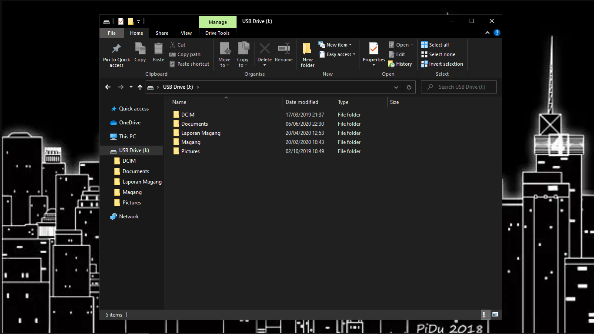

 

dan ketika kalian mencabut flashDisk tersebut dari port usb yang ada pada komputer atau laptop kalian maka tampilan pada laptop kalian akan menjadi seperti gambar yang dibawah ini;

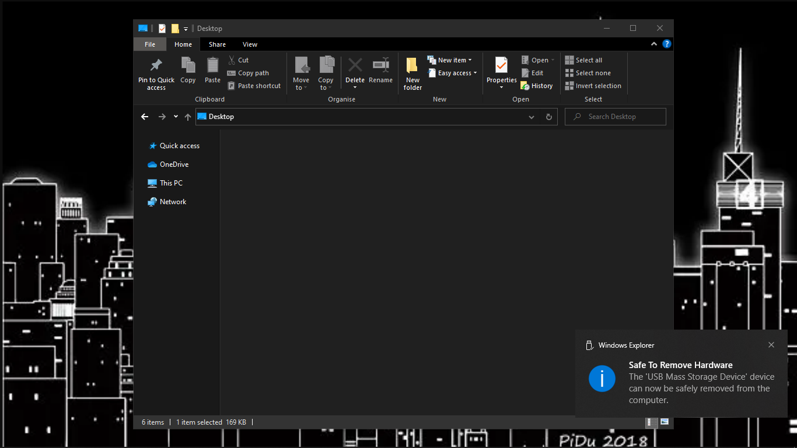

 

<h2 align="center" >LAYANAN SISTEM OPERASI</h2>

Layanan sistem operasi dirancang untuk membuat pemrograman menjadi lebih mudah. Sebuah sistem operasi yang baik menurut Tanenbaum harus memiliki layanan sebagai berikut:

1. Pembuatan program
2. Eksekusi program
3. Operasi Masukan/Keluaran
4. manipulasi sistem berkas
5. Komunikasi
6. Deteksi error
7. Alokasi sumber daya
8. Proteksi
9. Accounting

Di bawah ini merupakan beberapa contoh penerapan dari Layanan Sistem Operasi yang ada pada Laptop saya:

### Layanan Pembuatan Program

Program Adalah suatu rancangan struktur, desain, kode skema, maupun bentuk yang lainnya dengan yang disusun sesuai alur Algoritma dengan tujuan mempermudah suatu permasalahan. sebuah program biasanya disebut juga dengan istilah Aplikasi, tujuannya adalah mempermudah suatu hal agar pekerjaan bisa lebih produktif dan lebih efisien. Adapun istilah programmer yaitu seseorang yang membuat atau merancang suatu Program tersebut. Sebuah program yang dapat dibaca oleh manusia biasa disebut dengan Kode Sumber atau source code.

Contohnya ketika kita ingin membuat suatu prograa html menggunkan software yang sudah disediakan oleh Pc/Laptop kalian yaitu notepad. Pertama-tama silahkan kalian buka notepad pada laptopp/pc kalian dengan klik windows pada keyboard lalu ketikan notepadseperti gambar dibawah ini;

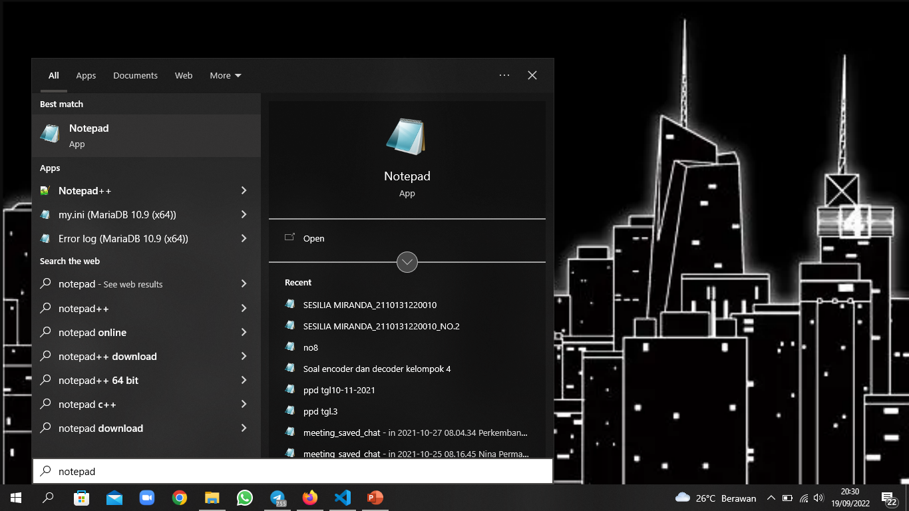

Ketika sudah masuk pada pada tampilan notepad kalian bisa langsung mengetikan contoh program, disini saya mencoba menuliskan tag dasar pada html;

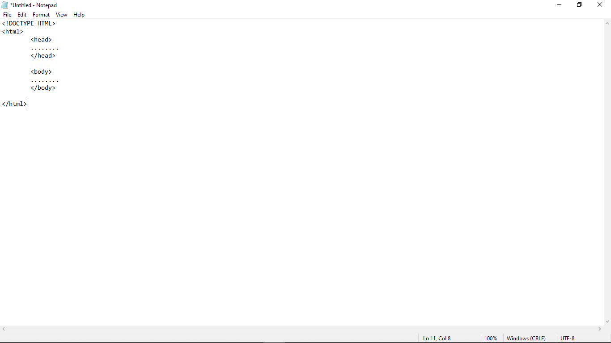

Setelah kode prograam diketikan kalian bisa menyimpan file nya dengan cara klik file pada pojok kiri atas dan pilih menu save seperti pada gambar di bawah ini;

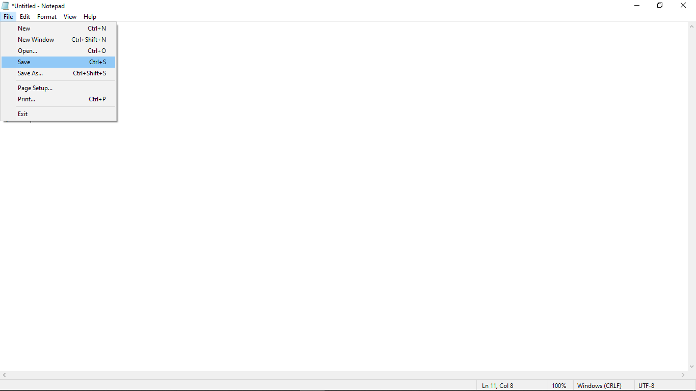

setelah kalian memilih menu save maka kalian bisa memberi nama file kaalian sesuka hati, disini saya memberikan nama percobaan pada file saya dan klil enter untuk menyimpannya seperti gambar dibawah ini;

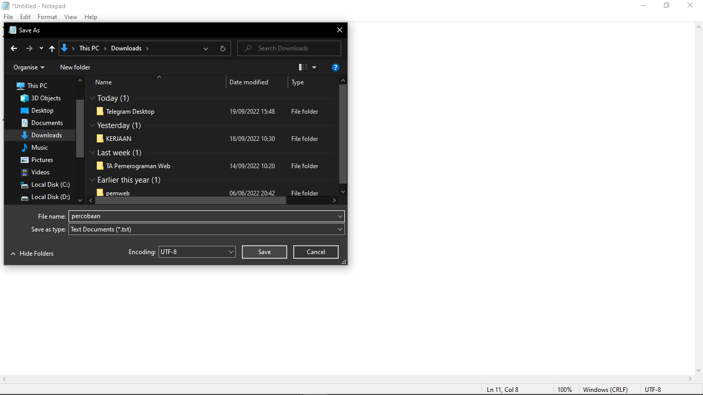

### Accounting

Accounting adalah merekam kegiatan pengguna, jatah pemakaian sumber daya (keadilan atau kebijaksanaan). jika pada sistem Operasi Windows kita bisa melihatnya pada TaksManager dengan cara berikut ini; pertama silahkan kalian buka task Manager pada laptopp/pc kalian dengan klik windows pada keyboard lalu ketikan Task Manager seperti gambar dibawah ini;

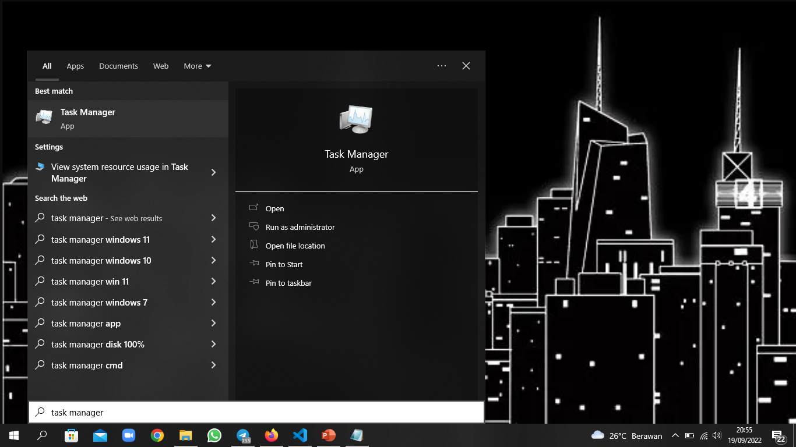

Setelah tampilan laptop kalian sudah sama seperti gambar sebelumnya maka kalian bisa klik open atau langsung klik enter untuk masuk ke menu Task Manager tersebut, jika sudah maka tampilan ya akan seperti gambar yang dibawah ini;

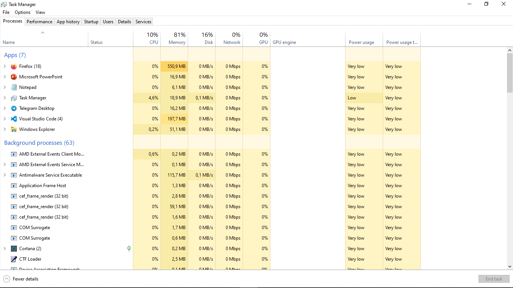 pada gambar diatas dapat kita lihat pemakaian sumber daya dan lain sebagainnya.
 

### Manipulasi Sitem Berkas

Sistem manipulasi berkas adalah kemampuan program untuk operasi pada berkas (membaca, menulis, membuat, dan menghapus berkas yang berupa file atau direktori). Seperti contohnya saya akan menghapus sseuah file yang ada pada laptop saya, yang pertama pilihlah file yang akan kalian hapus contohnya seperti gambar yang dibawah ini;

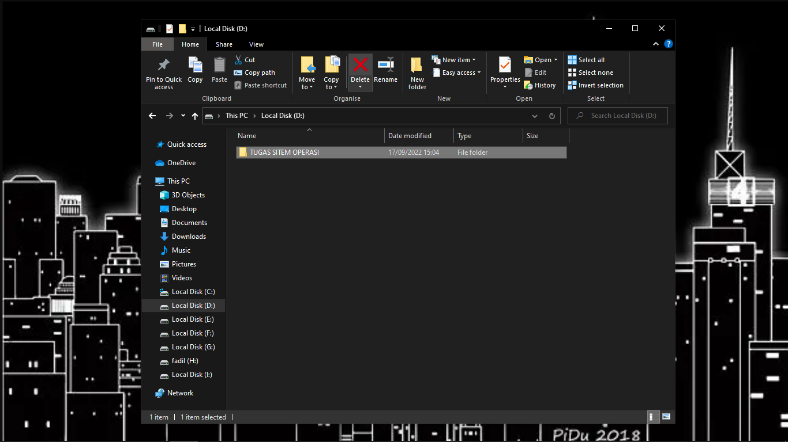 Jika sudah maka kalian bisa menghapusnya menguakan menu delete pada bagian atas atau kalian bisa lanngsung klil tombol del pada laptop kalian
 

Ketika kalian sudah menghapusnya maka tampilan laptop kalianseperti gambar yang dibawah ini;

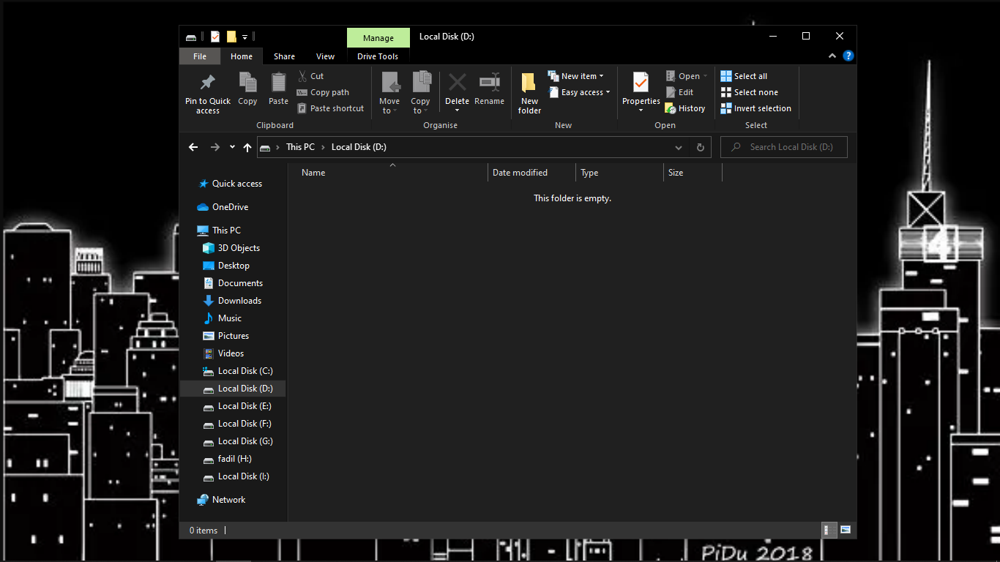
 

<h2 align="center">SYSTEM CALL</h2>

System calls yang berhubungan dengan berkas sangat diperlukan. Seperti ketika kita ingin membuat atau menghapus suatu berkas. Atau ketika ingin membuka atau menutup suatu berkas yang telah ada, membaca berkas tersebut, dan menulis berkas itu. System calls juga diperlukan ketika kita ingin mengetahui atribut dari suatu berkas atau ketika kita juga ingin merubah atribut tersebut. Yang termasuk atribut berkas adalah nama berkas, jenis berkas, dan lain-lain. Ada juga system calls yang menyediakan mekanisme lain yang berhubungan dengan direktori atau sistim berkas secara keseluruhan. Jadi bukan hanya berhubungan dengan satu spesifik berkas. Contohnya membuat atau menghapus suatu direktori, dan lain-lain.

### Membuat Folder Baru 

Yang pertama saya akan memberikan contoh bagaimana cara membuat folder baru menggunakan cmd dari laptop masing-masing, pastikan kalian sudah membuka cmd pada laptop kalian terlebih dahulu;

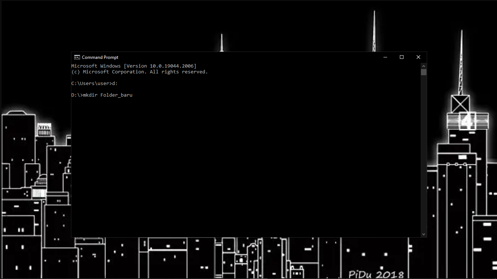 Untuk membuat sebuah folder baru maka kalian bisa mengetikan mkdir nama_folder seperti contoh gambar di atas.
 

Jika kalian sudah mengetikan perintah tersebut maka selanjutnya kalian bisa langsung klik enter untuk menjalankan programnya hingga taampilannya seperti gambar dibawah ini;

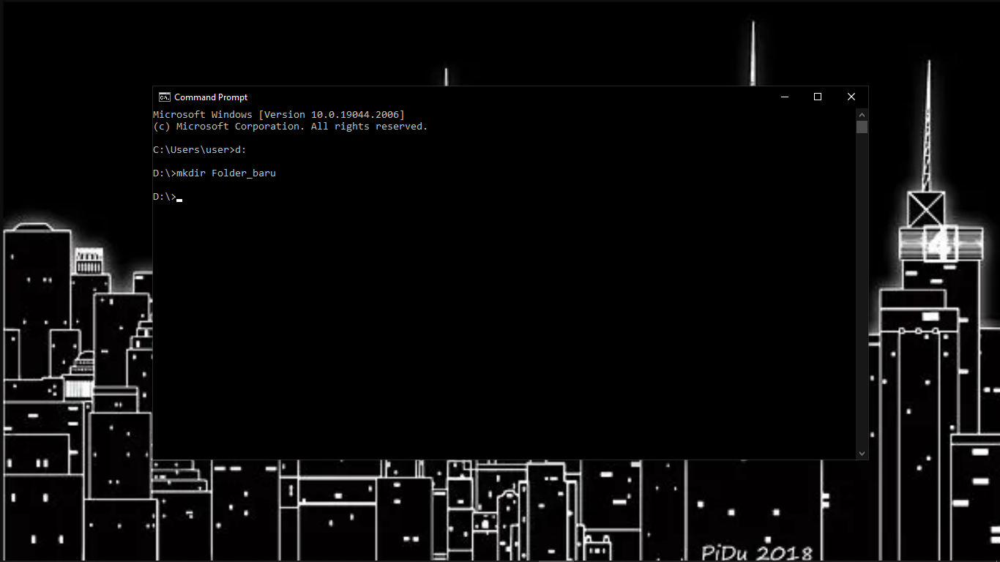 setelah itu kalian bisa cek pada tempat dimana kalian menyimpan folder tersebut dan apakah folder tersebut berhasil dibuat.
 

### Membuat File text dengan isinya

Yang pertama saya akan memberikan contoh bagaimana cara membuat folder baru menggunakan cmd dari laptop masing-masing, pastikan kalian sudah membuka cmd pada laptop kalian terlebih dahulu;

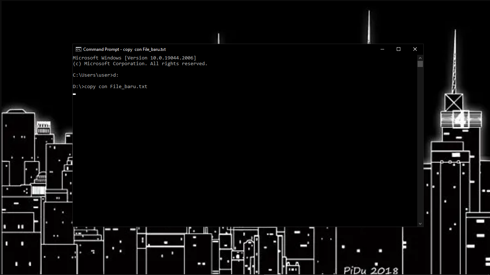 Untuk membuat sebuah file baru maka kalian bisa mengetikan copy con nama_file seperti contoh gambar di atas lalu tekan enter pada keyboard.
 

Jika kalian sudah mengetikan perintah tersebut maka selanjutnya kalian bisa langsung mengetikan isi dari file tersebut kemudian klik ctrl + c untuk menjalankan programnya hingga taampilannya seperti gambar dibawah ini;

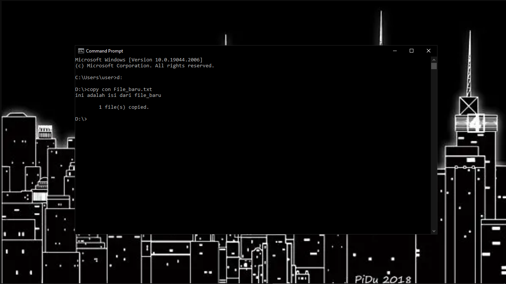 
 

setelah itu kalian bisa cek pada tempat dimana kalian menyimpan folder tersebut dan apakah folder tersebut berhasil dibuat seperti gambar dibawah ini;

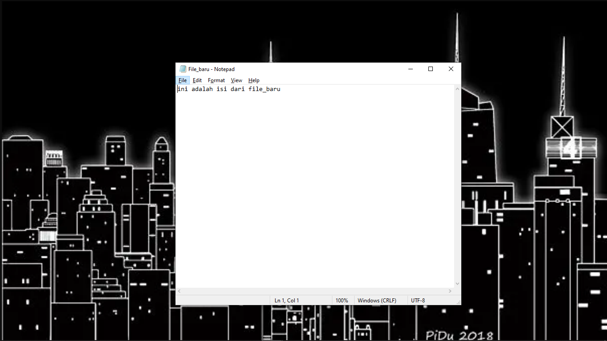
 

### Menghapus File dengan CMD

Yang pertama saya akan memberikan contoh bagaimana cara membuat folder baru menggunakan cmd dari laptop masing-masing, pastikan kalian sudah membuka cmd pada laptop kalian terlebih dahulu 

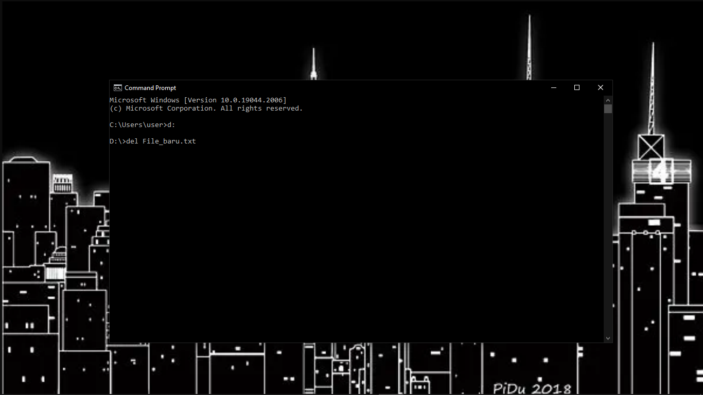 Untuk menghapus sebuah file maka kalian bisa mengetikan del nama_file seperti contoh gambar di atas.
 

Jika kalian sudah mengetikan perintah tersebut maka selanjutnya kalian bisa langsung klik enter untuk menjalankan programnya hingga taampilannya seperti gambar dibawah ini;

 setelah itu kalian bisa cek pada tempat dimana kalian menyimpan folder tersebut dan apakah file tersebut berhasil dihapus
 
